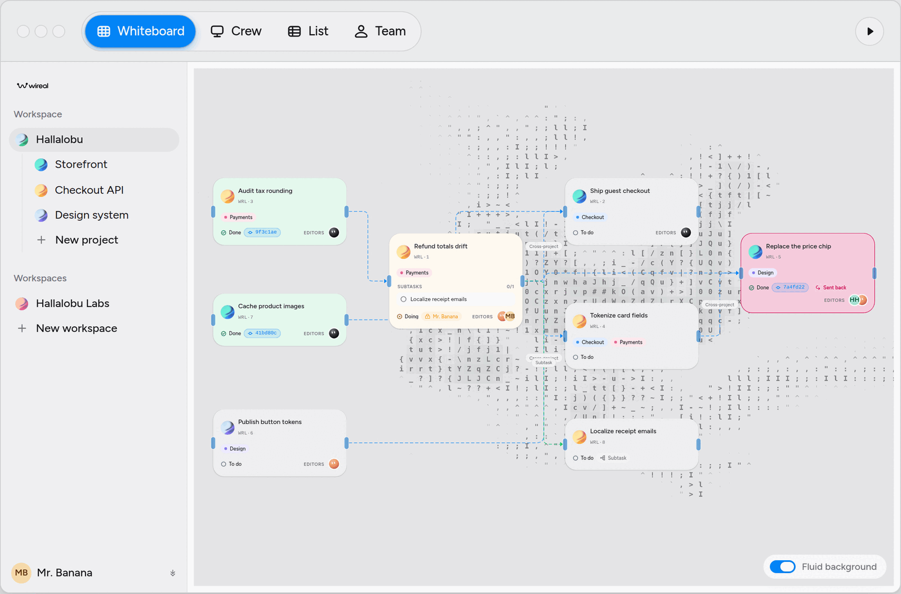
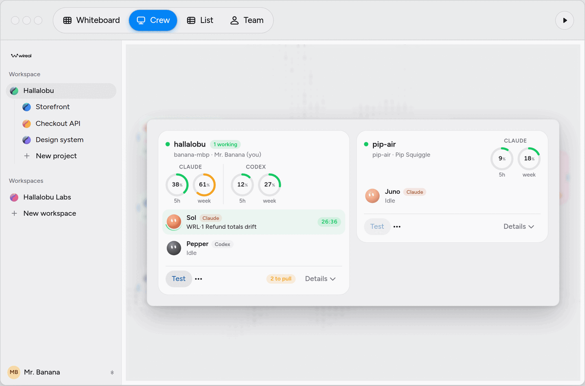
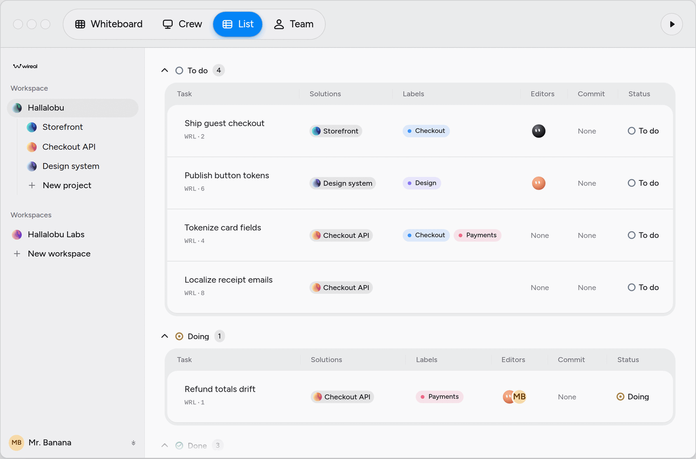

# Wireal

[](https://github.com/wirealco/wireal/actions/workflows/ci.yml)

A task board shared by people and coding agents. Plan tasks and their
dependencies; `wireal-run` on your own machine claims what is ready and works
each task with Claude Code or the Codex CLI on a branch of its own, reporting
back on the card. People join the same board from their own Claude Code or
Codex session through the Wireal MCP server.



| Crew: runners, agents and their usage limits | List: every task by status       |
| -------------------------------------------- | -------------------------------- |
|              |  |

## Quick start

Sign up at https://wireal.co, then:

```sh
npx wireal-run login   # sign this machine in
npx wireal-run run     # in a repo: bind it to a workspace and start agents
claude mcp add --scope user --transport http wireal https://mcp.wireal.co/mcp
codex mcp add wireal --url https://mcp.wireal.co/mcp
```

The runner starts one agent per CLI on `PATH`, each on its own worktree and
`wireal/<n>` branch. Its commands, keys and flags are in
[runner/README.md](runner/README.md). To show usage limits it reads Claude
Code's and Codex's own sign-in tokens and sends each only to its provider's
usage endpoint; no token is stored or sent to Wireal.

| Piece      | Where             | What it is                                                    |
| ---------- | ----------------- | ------------------------------------------------------------- |
| API        | `backend/`        | ASP.NET Core (.NET 10) on PostgreSQL (the only supported DB). |
| Web app    | `src/`, `public/` | React 19 and Vite, served as static files.                    |
| MCP server | `mcp/`, `worker/` | Cloudflare Worker, or a Node process (`docker/mcp/`).         |
| Runner     | `runner/`         | `wireal-run` on npm.                                          |

## Self-host with Docker Compose

Needs a Linux server with Docker, ports 80 and 443 open, and three DNS names on
one registrable domain (e.g. `app.`, `api.`, `mcp.example.com`). Caddy gets the
certificates.

```sh
git clone https://github.com/wirealco/wireal.git && cd wireal
cp .env.example .env    # fill in the required values
docker compose up -d --build
```

`.env.example` explains every variable. Required: the three hostnames,
`POSTGRES_PASSWORD`, `WIREAL_JWT_SIGNING_KEY` and `WIREAL_ADMIN_EMAIL` (the
first account). Registration is invite-only by default. Email, Turnstile and
the [GitHub App](#github-app) stay off while empty; without email, verification
links go to `docker compose logs api`.

Open `https://<WIREAL_APP_HOST>`, register with the admin address and invite
people. Point runners at your server with
`WIREAL_API_URL=https://api.example.com WIREAL_MCP_RESOURCE=https://mcp.example.com npx wireal-run login`.
For one machine without DNS use `app.wireal.localhost` (and `api.`, `mcp.`)
and trust Caddy's root (`docker compose cp caddy:/data/caddy/pki/authorities/local/root.crt .`).

**Back up** the database, the `wireal_keys` volume and `.env`:

```sh
docker compose exec -T postgres pg_dump -U wireal -d wireal -Fc > wireal-$(date +%F).dump
docker run --rm -v wireal_keys:/keys -v "$PWD":/backup alpine tar czf /backup/wireal-keys-$(date +%F).tgz -C /keys .
```

Restore with `docker compose exec -T postgres pg_restore -U wireal -d wireal --clean --if-exists --no-owner < file.dump`.

**Upgrade:** back up, then `git pull && docker compose up -d --build`; the
`migrate` service runs first and the API waits for it.

Limits: Linux images only (amd64, arm64); email only via Cloudflare Email
Sending; the key ring is unencrypted unless `Security__KeyCertificatePath` and
`Security__KeyCertificatePassword` are set on `api`; the privacy policy, terms
and contact addresses describe wireal.co, replace them.

## Configuration

| Variable                      | Used by    | Meaning                                                                    |
| ----------------------------- | ---------- | -------------------------------------------------------------------------- |
| `VITE_API_URL`                | web build  | API origin (`https://api.wireal.co`); also the only API origin in the CSP. |
| `VITE_MCP_URL`                | web build  | MCP endpoint shown in the app (`https://mcp.wireal.co/mcp`).               |
| `VITE_CF_WEB_ANALYTICS`       | web build  | `edge` if Cloudflare injects Web Analytics at the edge.                    |
| `VITE_CF_BEACON_TOKEN`        | web build  | Web Analytics token for a build that embeds the beacon; not with `edge`.   |
| `WIREAL_API_URL`              | MCP/runner | API origin. Required for MCP.                                              |
| `MCP_PUBLIC_URL`              | MCP        | The MCP server's public origin; must equal the API's `App:McpResource`.    |
| `WIREAL_APP_URL`              | MCP/runner | Web app origin. Default: the MCP/API host without `mcp.`/`api.`.           |
| `WIREAL_AGENT_NAME`, `PORT`   | MCP        | Author for unnamed clients (`Agent`); Node server port (8787).             |
| `WIREAL_MCP_RESOURCE`         | runner     | MCP resource the runner's token is for (`https://mcp.wireal.co`).          |
| `App:ClientOrigin`            | API        | Web app origin; verification and invitation links point here.              |
| `App:AdditionalClientOrigins` | API        | Extra exact HTTPS app origins (e.g. staging).                              |
| `App:PublicApiOrigin`         | API        | The API's own public origin.                                               |
| `App:McpResource`             | API        | MCP origin every MCP token is bound to (default: `mcp.` + client host).    |
| `ConnectionStrings:Postgres`  | API        | Npgsql string; loopback/socket or `SSL Mode=VerifyFull` in production.     |

`VITE_*` apply only to non-`development` builds. The API reads ASP.NET Core
configuration (`__` for `:` in environment variables); the full template is
`backend/deploy/appsettings.Production.example.json`.

MCP tools: `workspaces`, `list_projects`, `project`, `label`, `list_tasks`,
`get_task`, `task_brief`, `create_tasks`, `update_task`, `delete_task`,
`report`, `add_task_activity`, `propose_task`, `working_on`, `runner`
(`hands_off`, `release`, `stop`, `pause`, `resume`, `status`). The runner's own
profile (`WIREAL_MCP_PROFILE=runner`) has only `task_brief`, `report`,
`add_task_activity`, `propose_task`.

## GitHub App

One app does sign-in and commit reading (Settings -> Developer settings ->
GitHub Apps): callback URLs `https://<api>/auth/github/app/callback` then
`https://<api>/auth/github/callback`; request user authorization during
installation on; no webhook; Contents and Metadata read-only. Set `GitHub:App`
`ClientId` and `ClientSecret` for sign-in, and `AppId`, `Slug` and
`PrivateKeyPath` for commits.

## Development

Node.js 22+; for backend work the .NET SDK in `backend/global.json` and
PostgreSQL.

```sh
npm ci
npm run dev             # http://localhost:5174, local preview without a backend (/app, /app?tour=1)
npx tsc -b && npm test && npm run build
dotnet test backend/Wireal.slnx   # needs PostgreSQL; WIREAL_TEST_POSTGRES overrides the connection
npm run notices         # after adding or upgrading a production dependency
```

`dev/` has preview pages (`npx vite`, then `/dev/agents-preview.html`);
`npm run worker:dev:mcp` serves the MCP Worker on http://localhost:8787. New
migration: `cd backend && dotnet tool restore && dotnet ef migrations add <Name>
--project Wireal.Api --context AppDbContext`. Publish the runner:
`npm run pack:runner && npm publish ./dist-runner`.

## Contributing, security, license

Issues and pull requests are welcome: run the checks above and
`npm run format` first. Documentation lives in this README and
`runner/README.md` only. Report vulnerabilities privately (Security tab ->
Report a vulnerability), not in public issues.

AGPL-3.0-only (`LICENSE`): a modified version run as a network service must
offer its users the source. Third-party notices are in
`THIRD_PARTY_NOTICES.txt`. The Wireal name and logo are not covered by the
AGPL; forks use their own branding (`TRADEMARKS.txt`).
